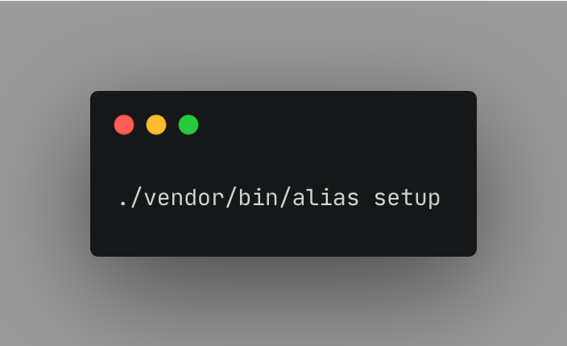
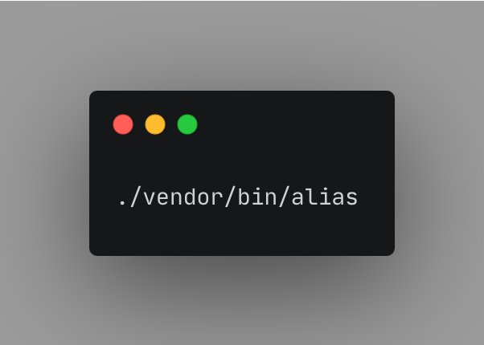
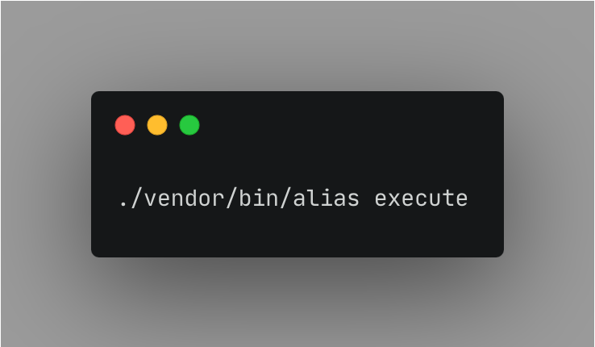
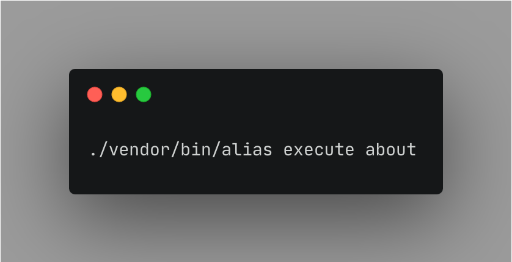
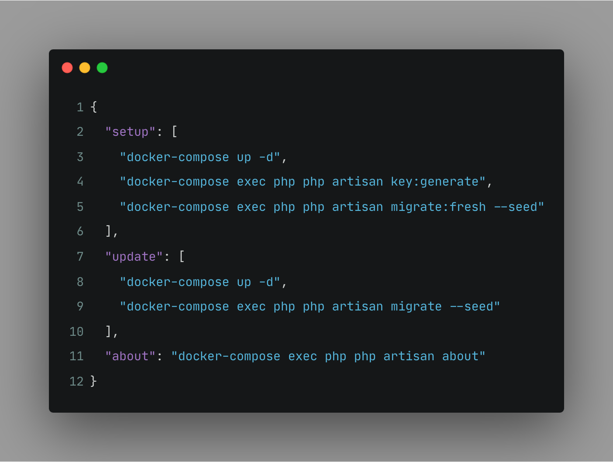

<a href="https://supportukrainenow.org/">

</a>

------

# Alias CLI
A PHP CLI application that helps you organize your aliases.

<p align="center">
  <a href="https://github.com/gipfel-dev/alias/actions"></a>
  <a href="https://packagist.org/packages/gipfel-dev/alias"></a>
  <a href="https://packagist.org/packages/gipfel-dev/alias"></a>
  <a href="https://packagist.org/packages/gipfel-dev/alias"></a>
</p>

## Installation
```bash
composer require gipfel-dev/alias
```

After installing Alias CLI we recommend to call the setup command once for automatically creation of `aliases.json`.



## Usage
### Summary
To get an overview of all available commands you can call alias without any parameters.



### Execute an alias
After defining your aliases in `aliases.json` or `aliases.dev.json` you can call



to get an overview of all available aliases. You can also call an alias directly:



## aliases.json
At the moment our packages scans your root directory of your project for following files
- `aliases.dev.json`
- `aliases.json`

Please be aware that your values must be executable by your terminal.

### `aliases.json` example


## Support the development
**Do you like this project? Support it by donating**

- PayPal: [Donate](https://paypal.me/alexandergaal95)
- Patreon: [Donate](https://www.patreon.com/alexandergaal)

## License
Alias CLI is an open-source software licensed under the MIT license.